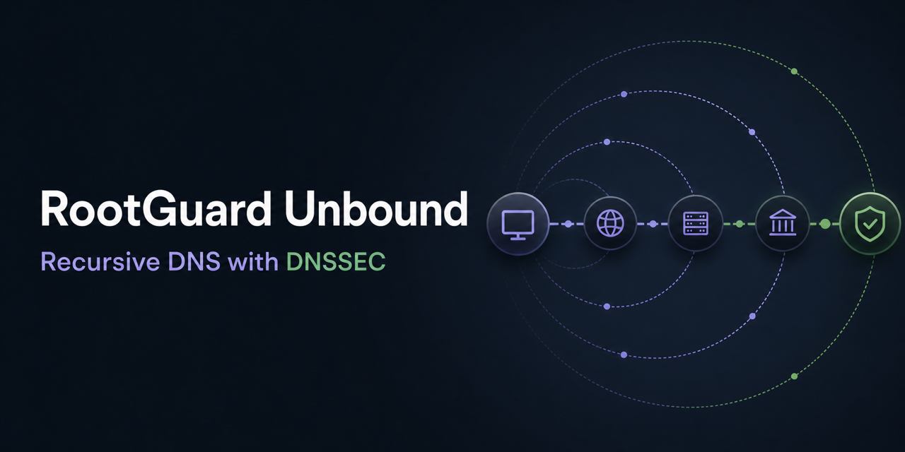

# RootGuard Unbound



**RootGuard Unbound is a hardened, multi-architecture recursive DNS resolver
container with DNSSEC validation.** Unbound 1.25.2 is compiled from its verified
official source archive on a digest-pinned Debian 13 base. The image provides an
immutable base configuration plus an update-safe modular configuration layer.

[](https://github.com/foxly-it/rootguard-unbound/actions/workflows/build.yml)
[](https://github.com/foxly-it/rootguard-unbound/pkgs/container/rootguard-unbound)
[](#verify-dnssec)
[](LICENSE)

[Container images](https://github.com/foxly-it/rootguard-unbound/pkgs/container/rootguard-unbound) ·
[RootGuard](https://github.com/foxly-it/rootguard) ·
[Manual](https://rootguard.foxly.de/docs.html#unbound) ·
[Security](#security-model)

> [!WARNING]
> This image is an internal recursive resolver. Never expose it directly to the
> public internet. Restrict access to trusted hosts and private container
> networks.

## Quick start

```sh
docker run -d \
  --name rootguard-unbound \
  -p 127.0.0.1:5335:5335/tcp \
  -p 127.0.0.1:5335:5335/udp \
  ghcr.io/foxly-it/rootguard-unbound:latest
```

Test recursive resolution:

```sh
dig @127.0.0.1 -p 5335 example.com A
```

The complete RootGuard stack connects AdGuard Home to this resolver and manages
its modular configuration through a validated preview, versioning, and rollback
workflow.

## Features

- Unbound `1.25.2`, compiled from the checksum-verified NLnet Labs source.
- Digest-pinned Debian 13 build and runtime base with version-pinned direct
  dependencies.
- Multi-architecture images for `amd64` and `arm64`.
- Published SBOM and SLSA provenance attestations.
- Daily reproducibility checks; dependency upgrades remain reviewed changes.
- DNSSEC validation with a writable RFC 5011 trust-anchor state.
- Non-root runtime, read-only compatible filesystem, and no added capabilities.
- Private-network access control and private-address protection.
- Loopback-only runtime control for bounded RootGuard diagnostics; the control
  port is not exposed or published.
- Immutable base configuration with modular includes under
  `/etc/unbound/unbound.d/`.
- Version tags derived from the compiled upstream binary.

## Docker Compose

```yaml
services:
  unbound:
    image: ghcr.io/foxly-it/rootguard-unbound:latest
    restart: unless-stopped
    ports:
      - "127.0.0.1:5335:5335/tcp"
      - "127.0.0.1:5335:5335/udp"
    read_only: true
    cap_drop:
      - ALL
    security_opt:
      - no-new-privileges:true
    volumes:
      - unbound-config:/etc/unbound/unbound.d
      - unbound-state:/var/lib/unbound

volumes:
  unbound-config:
  unbound-state:
```

## Configuration model

| Path | Purpose |
| --- | --- |
| `/etc/unbound/unbound.conf` | Immutable security and network baseline |
| `/etc/unbound/unbound.d/` | Modular, update-safe managed configuration |
| `/var/lib/unbound/root.key` | Writable DNSSEC trust-anchor state |

The container always runs Unbound as the fixed numeric identity `100:101`.
Keeping this identity stable prevents Debian base-image user allocation changes
from invalidating ownership on persistent trust-anchor volumes.

The base configuration listens on port `5335`, permits localhost and private
container ranges, validates DNSSEC, and protects private addresses. RootGuard
generates only modular includes and validates the complete result with
`unbound-checkconf` before activation.

## Verify DNSSEC

```sh
dig @127.0.0.1 -p 5335 example.com A
dig @127.0.0.1 -p 5335 dnssec-failed.org A
```

A valid signed response should include the `ad` flag. The intentionally broken
domain `dnssec-failed.org` must return `SERVFAIL`.

## Image tags and builds

The GitHub Actions pipeline validates the configuration and pinned source
metadata, publishes both architectures with SBOM and provenance attestations,
and tags images using the compiled upstream version:

- `latest`
- upstream Unbound version
- major/minor Unbound version
- optional RootGuard release tag

The exact source URL, SHA-256 checksum, base-image digest, dependency pins, and
the update procedure are documented in [BUILDING.md](BUILDING.md).

## Security model

- Runs as the fixed non-root `unbound` identity `100:101`.
- Supports a read-only root filesystem and drops all Linux capabilities.
- Is not configured as a public open resolver.
- Hides resolver identity and minimizes responses.
- Applies DNSSEC and private-address protections by default.

Report vulnerabilities privately as described in [SECURITY.md](SECURITY.md).

## Contributing

Read [CONTRIBUTING.md](CONTRIBUTING.md) before opening a pull request. Good
starting points are issues labeled
[`good first issue`](https://github.com/foxly-it/rootguard-unbound/labels/good%20first%20issue)
or [`help wanted`](https://github.com/foxly-it/rootguard-unbound/labels/help%20wanted).

## License

RootGuard Unbound is licensed under
[GNU AGPL-3.0-or-later](LICENSE). The software license does not grant rights to
the RootGuard or Foxly IT names or logos.
